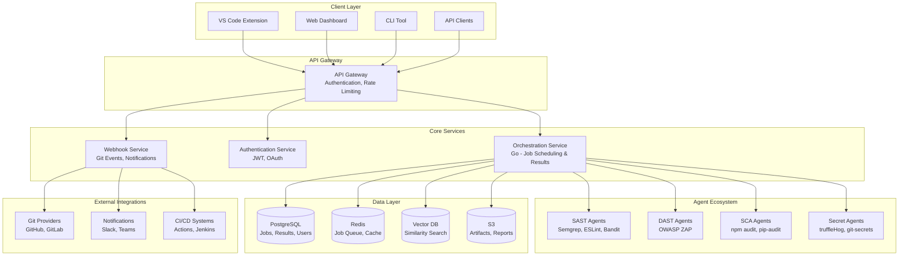

# AgentScan Design Document

## Overview

AgentScan is a multi-agent security scanning platform that orchestrates multiple security tools to provide developers with accurate, fast, and actionable security analysis. The system reduces false positives through consensus-based scoring while maintaining comprehensive coverage across multiple programming languages and vulnerability types.

The core architecture follows a microservices pattern with containerized agents, centralized orchestration, and multiple integration points for seamless developer workflow integration.

## Architecture

### High-Level System Architecture



### Service Architecture Patterns

#### 1. Agent Pattern
Each security tool is wrapped in a standardized agent interface that provides:
- Consistent execution model
- Standardized result format
- Health monitoring
- Resource management
- Error handling

#### 2. Orchestrator Pattern
Central orchestration service manages:
- Job scheduling and prioritization
- Agent lifecycle management
- Result aggregation and consensus
- Performance monitoring
- Failure recovery

#### 3. Event-Driven Architecture
System components communicate through:
- Redis pub/sub for real-time events
- Webhook callbacks for external integrations
- Message queues for reliable processing
- Event sourcing for audit trails

## Components and Interfaces

### Core Agent Interface

```go
type SecurityAgent interface {
    // Scan executes the security analysis
    Scan(ctx context.Context, config ScanConfig) (*ScanResult, error)
    
    // HealthCheck verifies agent is operational
    HealthCheck(ctx context.Context) error
    
    // GetConfig returns agent configuration and capabilities
    GetConfig() AgentConfig
    
    // GetVersion returns agent and tool version information
    GetVersion() VersionInfo
}

type ScanConfig struct {
    RepoURL     string            `json:"repo_url"`
    Branch      string            `json:"branch"`
    Commit      string            `json:"commit"`
    Languages   []string          `json:"languages"`
    Files       []string          `json:"files,omitempty"` // For incremental scans
    Rules       []string          `json:"rules,omitempty"`
    Options     map[string]string `json:"options,omitempty"`
    Timeout     time.Duration     `json:"timeout"`
}

type ScanResult struct {
    AgentID     string     `json:"agent_id"`
    Status      ScanStatus `json:"status"`
    Findings    []Finding  `json:"findings"`
    Metadata    Metadata   `json:"metadata"`
    Duration    time.Duration `json:"duration"`
    Error       string     `json:"error,omitempty"`
}

type Finding struct {
    ID          string           `json:"id"`
    Tool        string           `json:"tool"`
    RuleID      string           `json:"rule_id"`
    Severity    Severity         `json:"severity"`
    Category    VulnCategory     `json:"category"`
    Title       string           `json:"title"`
    Description string           `json:"description"`
    File        string           `json:"file"`
    Line        int              `json:"line"`
    Column      int              `json:"column,omitempty"`
    Code        string           `json:"code,omitempty"`
    Fix         *FixSuggestion   `json:"fix,omitempty"`
    Confidence  float64          `json:"confidence"`
    References  []string         `json:"references,omitempty"`
}
```

### Orchestration Service Interface

```go
type OrchestrationService interface {
    // SubmitScan queues a new scan job
    SubmitScan(ctx context.Context, req ScanRequest) (*ScanJob, error)
    
    // GetScanStatus retrieves current scan status
    GetScanStatus(ctx context.Context, jobID string) (*ScanStatus, error)
    
    // GetScanResults retrieves scan results with filtering
    GetScanResults(ctx context.Context, jobID string, filter ResultFilter) (*ScanResults, error)
    
    // CancelScan cancels a running scan
    CancelScan(ctx context.Context, jobID string) error
    
    // ListScans lists scans with pagination
    ListScans(ctx context.Context, filter ScanFilter, pagination Pagination) (*ScanList, error)
}

type ScanRequest struct {
    RepoURL      string            `json:"repo_url"`
    Branch       string            `json:"branch"`
    Commit       string            `json:"commit"`
    Incremental  bool              `json:"incremental"`
    Priority     Priority          `json:"priority"`
    Agents       []string          `json:"agents,omitempty"` // Optional agent selection
    Options      map[string]string `json:"options,omitempty"`
    CallbackURL  string            `json:"callback_url,omitempty"`
}
```

### Consensus Engine Interface

```go
type ConsensusEngine interface {
    // AnalyzeFindings processes multiple agent results
    AnalyzeFindings(ctx context.Context, findings []Finding) (*ConsensusResult, error)
    
    // UpdateModel trains the consensus model with user feedback
    UpdateModel(ctx context.Context, feedback []UserFeedback) error
    
    // GetConfidenceScore calculates confidence for a finding
    GetConfidenceScore(ctx context.Context, finding Finding, context ConsensusContext) (float64, error)
}

type ConsensusResult struct {
    DeduplicatedFindings []ConsensusFinding `json:"deduplicated_findings"`
    Statistics          ConsensusStats     `json:"statistics"`
    ModelVersion        string             `json:"model_version"`
}

type ConsensusFinding struct {
    Finding
    ConsensusScore   float64   `json:"consensus_score"`
    AgreementCount   int       `json:"agreement_count"`
    DisagreementCount int      `json:"disagreement_count"`
    SupportingTools  []string  `json:"supporting_tools"`
    ConflictingTools []string  `json:"conflicting_tools"`
}
```

## Data Models

### Database Schema

#### Core Tables

```sql
-- Users and authentication
CREATE TABLE users (
    id UUID PRIMARY KEY DEFAULT gen_random_uuid(),
    email VARCHAR(255) UNIQUE NOT NULL,
    name VARCHAR(255) NOT NULL,
    avatar_url VARCHAR(500),
    github_id INTEGER UNIQUE,
    gitlab_id INTEGER UNIQUE,
    created_at TIMESTAMP WITH TIME ZONE DEFAULT NOW(),
    updated_at TIMESTAMP WITH TIME ZONE DEFAULT NOW()
);

-- Organizations and teams
CREATE TABLE organizations (
    id UUID PRIMARY KEY DEFAULT gen_random_uuid(),
    name VARCHAR(255) NOT NULL,
    slug VARCHAR(100) UNIQUE NOT NULL,
    settings JSONB DEFAULT '{}',
    created_at TIMESTAMP WITH TIME ZONE DEFAULT NOW(),
    updated_at TIMESTAMP WITH TIME ZONE DEFAULT NOW()
);

CREATE TABLE organization_members (
    id UUID PRIMARY KEY DEFAULT gen_random_uuid(),
    organization_id UUID REFERENCES organizations(id) ON DELETE CASCADE,
    user_id UUID REFERENCES users(id) ON DELETE CASCADE,
    role VARCHAR(50) NOT NULL DEFAULT 'member',
    created_at TIMESTAMP WITH TIME ZONE DEFAULT NOW(),
    UNIQUE(organization_id, user_id)
);

-- Repositories
CREATE TABLE repositories (
    id UUID PRIMARY KEY DEFAULT gen_random_uuid(),
    organization_id UUID REFERENCES organizations(id) ON DELETE CASCADE,
    name VARCHAR(255) NOT NULL,
    url VARCHAR(500) NOT NULL,
    provider VARCHAR(50) NOT NULL, -- github, gitlab, bitbucket
    provider_id VARCHAR(100) NOT NULL,
    default_branch VARCHAR(100) DEFAULT 'main',
    languages JSONB DEFAULT '[]',
    settings JSONB DEFAULT '{}',
    last_scan_at TIMESTAMP WITH TIME ZONE,
    created_at TIMESTAMP WITH TIME ZONE DEFAULT NOW(),
    updated_at TIMESTAMP WITH TIME ZONE DEFAULT NOW(),
    UNIQUE(provider, provider_id)
);

-- Scan jobs
CREATE TABLE scan_jobs (
    id UUID PRIMARY KEY DEFAULT gen_random_uuid(),
    repository_id UUID REFERENCES repositories(id) ON DELETE CASCADE,
    user_id UUID REFERENCES users(id) ON DELETE SET NULL,
    branch VARCHAR(100) NOT NULL,
    commit_sha VARCHAR(40) NOT NULL,
    scan_type VARCHAR(50) NOT NULL, -- full, incremental, ide
    priority INTEGER DEFAULT 5,
    status VARCHAR(50) NOT NULL DEFAULT 'queued',
    agents_requested JSONB DEFAULT '[]',
    agents_completed JSONB DEFAULT '[]',
    started_at TIMESTAMP WITH TIME ZONE,
    completed_at TIMESTAMP WITH TIME ZONE,
    error_message TEXT,
    metadata JSONB DEFAULT '{}',
    created_at TIMESTAMP WITH TIME ZONE DEFAULT NOW(),
    updated_at TIMESTAMP WITH TIME ZONE DEFAULT NOW()
);

-- Scan results and findings
CREATE TABLE scan_results (
    id UUID PRIMARY KEY DEFAULT gen_random_uuid(),
    scan_job_id UUID REFERENCES scan_jobs(id) ON DELETE CASCADE,
    agent_name VARCHAR(100) NOT NULL,
    status VARCHAR(50) NOT NULL,
    findings_count INTEGER DEFAULT 0,
    duration_ms INTEGER,
    error_message TEXT,
    raw_output JSONB,
    created_at TIMESTAMP WITH TIME ZONE DEFAULT NOW()
);

CREATE TABLE findings (
    id UUID PRIMARY KEY DEFAULT gen_random_uuid(),
    scan_result_id UUID REFERENCES scan_results(id) ON DELETE CASCADE,
    scan_job_id UUID REFERENCES scan_jobs(id) ON DELETE CASCADE,
    tool VARCHAR(100) NOT NULL,
    rule_id VARCHAR(200) NOT NULL,
    severity VARCHAR(20) NOT NULL,
    category VARCHAR(100) NOT NULL,
    title VARCHAR(500) NOT NULL,
    description TEXT,
    file_path VARCHAR(1000) NOT NULL,
    line_number INTEGER,
    column_number INTEGER,
    code_snippet TEXT,
    confidence DECIMAL(3,2) DEFAULT 0.5,
    consensus_score DECIMAL(3,2),
    status VARCHAR(50) DEFAULT 'open', -- open, fixed, ignored, false_positive
    fix_suggestion JSONB,
    references JSONB DEFAULT '[]',
    created_at TIMESTAMP WITH TIME ZONE DEFAULT NOW(),
    updated_at TIMESTAMP WITH TIME ZONE DEFAULT NOW()
);

-- User feedback for ML training
CREATE TABLE user_feedback (
    id UUID PRIMARY KEY DEFAULT gen_random_uuid(),
    finding_id UUID REFERENCES findings(id) ON DELETE CASCADE,
    user_id UUID REFERENCES users(id) ON DELETE CASCADE,
    action VARCHAR(50) NOT NULL, -- fixed, ignored, false_positive, confirmed
    comment TEXT,
    created_at TIMESTAMP WITH TIME ZONE DEFAULT NOW(),
    UNIQUE(finding_id, user_id)
);
```

#### Indexing Strategy

```sql
-- Performance indexes
CREATE INDEX idx_scan_jobs_repository_status ON scan_jobs(repository_id, status);
CREATE INDEX idx_scan_jobs_created_at ON scan_jobs(created_at DESC);
CREATE INDEX idx_findings_scan_job_severity ON findings(scan_job_id, severity);
CREATE INDEX idx_findings_file_path ON findings(file_path);
CREATE INDEX idx_findings_status ON findings(status);
CREATE INDEX idx_user_feedback_finding ON user_feedback(finding_id);

-- Composite indexes for common queries
CREATE INDEX idx_findings_repo_status_severity ON findings(scan_job_id, status, severity);
CREATE INDEX idx_scan_jobs_repo_branch_commit ON scan_jobs(repository_id, branch, commit_sha);
```

### Caching Strategy

#### Redis Data Structures

```go
// Job queue management
type JobQueue struct {
    HighPriority   string // "jobs:high"
    MediumPriority string // "jobs:medium"
    LowPriority    string // "jobs:low"
}

// Scan result caching
type ScanCache struct {
    ResultKey    string // "scan:result:{job_id}"
    StatusKey    string // "scan:status:{job_id}"
    ProgressKey  string // "scan:progress:{job_id}"
    TTL          time.Duration // 24 hours
}

// Agent health monitoring
type AgentHealth struct {
    HealthKey    string // "agent:health:{agent_name}"
    MetricsKey   string // "agent:metrics:{agent_name}"
    TTL          time.Duration // 5 minutes
}

// User session management
type UserSession struct {
    SessionKey   string // "session:{user_id}"
    TTL          time.Duration // 8 hours
}
```

## Error Handling

### Error Classification

```go
type ErrorType string

const (
    ErrorTypeValidation    ErrorType = "validation"
    ErrorTypeAuthentication ErrorType = "authentication"
    ErrorTypeAuthorization ErrorType = "authorization"
    ErrorTypeNotFound      ErrorType = "not_found"
    ErrorTypeConflict      ErrorType = "conflict"
    ErrorTypeRateLimit     ErrorType = "rate_limit"
    ErrorTypeInternal      ErrorType = "internal"
    ErrorTypeExternal      ErrorType = "external"
    ErrorTypeTimeout       ErrorType = "timeout"
)

type AppError struct {
    Type       ErrorType         `json:"type"`
    Code       string            `json:"code"`
    Message    string            `json:"message"`
    Details    map[string]string `json:"details,omitempty"`
    RequestID  string            `json:"request_id"`
    Timestamp  time.Time         `json:"timestamp"`
    Cause      error             `json:"-"`
}
```

### Error Handling Strategies

#### 1. Agent Failure Handling
- **Timeout Management**: Each agent has configurable timeout limits
- **Retry Logic**: Exponential backoff for transient failures
- **Graceful Degradation**: Continue with available agents if some fail
- **Circuit Breaker**: Temporarily disable failing agents

#### 2. External Service Failures
- **Git Provider Outages**: Cache repository metadata locally
- **Notification Failures**: Queue notifications for retry
- **Database Failures**: Implement read replicas and connection pooling
- **Queue Failures**: Persist jobs to database as backup

#### 3. Resource Exhaustion
- **Memory Limits**: Container-level memory limits with monitoring
- **CPU Throttling**: Queue management based on system load
- **Disk Space**: Automatic cleanup of temporary files
- **Network Bandwidth**: Rate limiting and connection pooling

### Recovery Procedures

```go
type RecoveryStrategy interface {
    // CanRecover determines if recovery is possible
    CanRecover(ctx context.Context, err error) bool
    
    // Recover attempts to recover from the error
    Recover(ctx context.Context, err error) error
    
    // GetRetryDelay returns delay before retry
    GetRetryDelay(attempt int) time.Duration
}

// Example implementation for agent failures
type AgentRecoveryStrategy struct {
    MaxRetries    int
    BaseDelay     time.Duration
    MaxDelay      time.Duration
    BackoffFactor float64
}
```

## Testing Strategy

### Testing Pyramid

#### 1. Unit Tests (70% of test coverage)
- **Agent Wrappers**: Test each agent's interface implementation
- **Consensus Engine**: Test scoring algorithms with various scenarios
- **API Handlers**: Test request/response handling and validation
- **Database Operations**: Test CRUD operations and transactions

```go
func TestSemgrepAgent_Scan(t *testing.T) {
    tests := []struct {
        name           string
        config         ScanConfig
        mockOutput     string
        expectedResult *ScanResult
        expectError    bool
    }{
        {
            name: "successful scan with findings",
            config: ScanConfig{
                RepoURL: "https://github.com/test/repo",
                Languages: []string{"javascript"},
            },
            mockOutput: `{"results": [{"check_id": "test-rule", "path": "test.js"}]}`,
            expectedResult: &ScanResult{
                Status: ScanStatusCompleted,
                Findings: []Finding{{
                    Tool: "semgrep",
                    RuleID: "test-rule",
                    File: "test.js",
                }},
            },
            expectError: false,
        },
        // Additional test cases...
    }
    
    for _, tt := range tests {
        t.Run(tt.name, func(t *testing.T) {
            // Test implementation
        })
    }
}
```

#### 2. Integration Tests (20% of test coverage)
- **End-to-End Workflows**: Test complete scan processes
- **Database Integration**: Test with real database operations
- **External Service Mocking**: Test with mocked external services
- **Performance Testing**: Test under load conditions

```go
func TestScanWorkflow_Integration(t *testing.T) {
    // Setup test environment
    db := setupTestDB(t)
    redis := setupTestRedis(t)
    orchestrator := NewOrchestrator(db, redis)
    
    // Test complete workflow
    scanReq := ScanRequest{
        RepoURL: "https://github.com/test/vulnerable-repo",
        Branch:  "main",
        Commit:  "abc123",
    }
    
    job, err := orchestrator.SubmitScan(context.Background(), scanReq)
    require.NoError(t, err)
    
    // Wait for completion
    waitForScanCompletion(t, orchestrator, job.ID, 30*time.Second)
    
    // Verify results
    results, err := orchestrator.GetScanResults(context.Background(), job.ID, ResultFilter{})
    require.NoError(t, err)
    assert.Greater(t, len(results.Findings), 0)
}
```

#### 3. End-to-End Tests (10% of test coverage)
- **User Journey Testing**: Test complete user workflows
- **Cross-Service Integration**: Test service interactions
- **Security Testing**: Test authentication and authorization
- **Performance Benchmarking**: Test system limits

### Test Data Management

```go
type TestDataManager struct {
    VulnerableRepos map[string]string // Language -> Repository URL
    ExpectedFindings map[string][]Finding // Repository -> Expected findings
    TestUsers       []User
    TestOrganizations []Organization
}

func (tdm *TestDataManager) SetupTestData(t *testing.T) {
    // Create test repositories with known vulnerabilities
    // Setup test users and organizations
    // Prepare expected results for validation
}
```

### Performance Testing

```go
func BenchmarkScanOrchestration(b *testing.B) {
    orchestrator := setupBenchmarkOrchestrator()
    
    b.ResetTimer()
    for i := 0; i < b.N; i++ {
        scanReq := ScanRequest{
            RepoURL: fmt.Sprintf("https://github.com/test/repo-%d", i),
            Branch:  "main",
        }
        
        _, err := orchestrator.SubmitScan(context.Background(), scanReq)
        if err != nil {
            b.Fatal(err)
        }
    }
}

func TestConcurrentScans(t *testing.T) {
    const numConcurrentScans = 100
    
    orchestrator := setupTestOrchestrator(t)
    
    var wg sync.WaitGroup
    errors := make(chan error, numConcurrentScans)
    
    for i := 0; i < numConcurrentScans; i++ {
        wg.Add(1)
        go func(id int) {
            defer wg.Done()
            
            scanReq := ScanRequest{
                RepoURL: fmt.Sprintf("https://github.com/test/repo-%d", id),
                Branch:  "main",
            }
            
            _, err := orchestrator.SubmitScan(context.Background(), scanReq)
            if err != nil {
                errors <- err
            }
        }(i)
    }
    
    wg.Wait()
    close(errors)
    
    for err := range errors {
        t.Error(err)
    }
}
```

## User Interface Design

### Design Philosophy

AgentScan's UI follows a "quiet luxury" design philosophy, prioritizing clarity, speed, and aesthetics for developers and designers. The interface draws inspiration from Linear, Vercel, and Superhuman, emphasizing clean lines, purposeful interactions, and minimal cognitive load.

### Design System

#### Typography
- **Primary Font**: Inter (system fallback: -apple-system, BlinkMacSystemFont, 'Segoe UI')
- **Font Weights**: 400 (Regular), 500 (Medium), 600 (Semibold)
- **Type Scale**: 12px, 14px, 16px, 18px, 24px, 32px, 48px

#### Grid System
- **Base Unit**: 8pt grid system for consistent spacing
- **Spacing Scale**: 4px, 8px, 16px, 24px, 32px, 48px, 64px, 96px
- **Container Max Width**: 1440px
- **Breakpoints**: 
  - Mobile: 320px - 768px
  - Tablet: 768px - 1024px
  - Desktop: 1024px+

#### Color Palette
```css
/* Primary Colors */
--color-primary: #2563eb;      /* Blue 600 */
--color-primary-hover: #1d4ed8; /* Blue 700 */

/* Accent Color */
--color-accent: #059669;       /* Emerald 600 */
--color-accent-hover: #047857; /* Emerald 700 */

/* Neutral Colors */
--color-gray-50: #f9fafb;
--color-gray-100: #f3f4f6;
--color-gray-200: #e5e7eb;
--color-gray-300: #d1d5db;
--color-gray-400: #9ca3af;
--color-gray-500: #6b7280;
--color-gray-600: #4b5563;
--color-gray-700: #374151;
--color-gray-800: #1f2937;
--color-gray-900: #111827;

/* Semantic Colors */
--color-success: #059669;
--color-warning: #d97706;
--color-error: #dc2626;
--color-info: #2563eb;

/* Background Colors */
--color-bg-primary: #ffffff;
--color-bg-secondary: #f9fafb;
--color-bg-tertiary: #f3f4f6;
```

#### Component Specifications

##### Top Navigation Bar
```css
.top-nav {
  height: 64px;
  background: var(--color-bg-primary);
  border-bottom: 1px solid var(--color-gray-200);
  padding: 0 24px;
  display: flex;
  align-items: center;
  justify-content: space-between;
}

.nav-logo {
  font-size: 18px;
  font-weight: 600;
  color: var(--color-gray-900);
}

.nav-actions {
  display: flex;
  align-items: center;
  gap: 16px;
}
```

##### Sidebar Navigation
```css
.sidebar {
  width: 240px;
  background: var(--color-bg-primary);
  border-right: 1px solid var(--color-gray-200);
  padding: 24px 0;
  height: calc(100vh - 64px);
}

.sidebar-section {
  margin-bottom: 32px;
  padding: 0 24px;
}

.sidebar-item {
  display: flex;
  align-items: center;
  padding: 8px 16px;
  margin: 0 8px;
  border-radius: 6px;
  font-size: 14px;
  font-weight: 500;
  color: var(--color-gray-700);
  transition: all 0.15s ease;
}

.sidebar-item:hover {
  background: var(--color-gray-100);
  color: var(--color-gray-900);
}

.sidebar-item.active {
  background: var(--color-primary);
  color: white;
}
```

##### Cards and Containers
```css
.card {
  background: var(--color-bg-primary);
  border: 1px solid var(--color-gray-200);
  border-radius: 8px;
  padding: 24px;
  transition: all 0.15s ease;
}

.card:hover {
  border-color: var(--color-gray-300);
  box-shadow: 0 4px 6px -1px rgba(0, 0, 0, 0.1);
}

.card-header {
  margin-bottom: 16px;
  padding-bottom: 16px;
  border-bottom: 1px solid var(--color-gray-200);
}

.card-title {
  font-size: 18px;
  font-weight: 600;
  color: var(--color-gray-900);
  margin-bottom: 4px;
}

.card-subtitle {
  font-size: 14px;
  color: var(--color-gray-500);
}
```

##### Buttons
```css
.btn {
  display: inline-flex;
  align-items: center;
  justify-content: center;
  padding: 8px 16px;
  border-radius: 6px;
  font-size: 14px;
  font-weight: 500;
  border: none;
  cursor: pointer;
  transition: all 0.15s ease;
  gap: 8px;
}

.btn-primary {
  background: var(--color-primary);
  color: white;
}

.btn-primary:hover {
  background: var(--color-primary-hover);
}

.btn-secondary {
  background: var(--color-bg-primary);
  color: var(--color-gray-700);
  border: 1px solid var(--color-gray-300);
}

.btn-secondary:hover {
  background: var(--color-gray-50);
  border-color: var(--color-gray-400);
}

.btn-ghost {
  background: transparent;
  color: var(--color-gray-600);
}

.btn-ghost:hover {
  background: var(--color-gray-100);
  color: var(--color-gray-900);
}
```

##### Tables
```css
.table {
  width: 100%;
  border-collapse: collapse;
  font-size: 14px;
}

.table th {
  text-align: left;
  padding: 12px 16px;
  font-weight: 500;
  color: var(--color-gray-600);
  border-bottom: 1px solid var(--color-gray-200);
  background: var(--color-bg-secondary);
}

.table td {
  padding: 16px;
  border-bottom: 1px solid var(--color-gray-200);
  color: var(--color-gray-700);
}

.table tr:hover {
  background: var(--color-bg-secondary);
}
```

##### Modals
```css
.modal-overlay {
  position: fixed;
  top: 0;
  left: 0;
  right: 0;
  bottom: 0;
  background: rgba(0, 0, 0, 0.5);
  display: flex;
  align-items: center;
  justify-content: center;
  z-index: 1000;
}

.modal {
  background: var(--color-bg-primary);
  border-radius: 12px;
  padding: 32px;
  max-width: 600px;
  width: 90vw;
  max-height: 80vh;
  overflow-y: auto;
  box-shadow: 0 25px 50px -12px rgba(0, 0, 0, 0.25);
}

.modal-header {
  margin-bottom: 24px;
}

.modal-title {
  font-size: 24px;
  font-weight: 600;
  color: var(--color-gray-900);
  margin-bottom: 8px;
}
```

### Page Layouts

#### Dashboard Overview
```
┌─────────────────────────────────────────────────────────────┐
│ Top Navigation (64px)                                       │
├─────────────┬───────────────────────────────────────────────┤
│ Sidebar     │ Main Content Area                             │
│ (240px)     │                                               │
│             │ ┌─────────────────────────────────────────┐   │
│ • Dashboard │ │ Scan Statistics Cards (Grid)            │   │
│ • Scans     │ │ ┌─────┐ ┌─────┐ ┌─────┐ ┌─────┐         │   │
│ • Findings  │ │ │Total│ │High │ │Med  │ │Low  │         │   │
│ • Settings  │ │ │Scans│ │Sev  │ │Sev  │ │Sev  │         │   │
│             │ │ └─────┘ └─────┘ └─────┘ └─────┘         │   │
│             │ └─────────────────────────────────────────┘   │
│             │                                               │
│             │ ┌─────────────────────────────────────────┐   │
│             │ │ Recent Scans Table                      │   │
│             │ │ Repository | Status | Findings | Time   │   │
│             │ │ ────────────────────────────────────────│   │
│             │ │ repo-1     | ✓      | 5 High   | 2m ago │   │
│             │ │ repo-2     | ⏳     | Running  | -      │   │
│             │ └─────────────────────────────────────────┘   │
│             │                                               │
│             │ ┌─────────────────────────────────────────┐   │
│             │ │ Findings Trend Chart                    │   │
│             │ │ [Line chart showing findings over time] │   │
│             │ └─────────────────────────────────────────┘   │
└─────────────┴───────────────────────────────────────────────┘
```

#### Scan Results Page
```
┌─────────────────────────────────────────────────────────────┐
│ Top Navigation                                              │
├─────────────┬───────────────────────────────────────────────┤
│ Sidebar     │ ┌─────────────────────────────────────────┐   │
│             │ │ Scan Header                             │   │
│             │ │ Repository: user/repo                   │   │
│             │ │ Branch: main | Commit: abc123           │   │
│             │ │ Status: ✓ Complete | Duration: 2m 34s   │   │
│             │ └─────────────────────────────────────────┘   │
│             │                                               │
│             │ ┌─────────────────────────────────────────┐   │
│             │ │ Filters & Actions                       │   │
│             │ │ [Severity] [Tool] [Status] [Export]     │   │
│             │ └─────────────────────────────────────────┘   │
│             │                                               │
│             │ ┌─────────────────────────────────────────┐   │
│             │ │ Findings Table                          │   │
│             │ │ Severity | Rule | File | Line | Tools   │   │
│             │ │ ────────────────────────────────────────│   │
│             │ │ 🔴 High  | XSS  | app.js | 42 | 3/5    │   │
│             │ │ 🟡 Med   | SQL  | db.js  | 15 | 2/5    │   │
│             │ └─────────────────────────────────────────┘   │
└─────────────┴───────────────────────────────────────────────┘
```

### Interactive States

#### Hover States
- **Cards**: Subtle border color change + soft shadow
- **Buttons**: Background color darkening by 5-10%
- **Table Rows**: Light gray background
- **Sidebar Items**: Light background + darker text

#### Click States
- **Buttons**: Brief scale transform (0.98) + darker background
- **Cards**: Slight scale down (0.995) for 100ms
- **Links**: Color change to primary color

#### Loading States
```css
.loading-skeleton {
  background: linear-gradient(90deg, 
    var(--color-gray-200) 25%, 
    var(--color-gray-100) 50%, 
    var(--color-gray-200) 75%);
  background-size: 200% 100%;
  animation: loading 1.5s infinite;
}

@keyframes loading {
  0% { background-position: 200% 0; }
  100% { background-position: -200% 0; }
}
```

### Responsive Design

#### Mobile Layout (320px - 768px)
- Sidebar collapses to hamburger menu
- Cards stack vertically with full width
- Tables become horizontally scrollable
- Reduced padding and font sizes

#### Tablet Layout (768px - 1024px)
- Sidebar remains visible but narrower (200px)
- Cards use 2-column grid
- Tables maintain full functionality

#### Desktop Layout (1024px+)
- Full sidebar (240px)
- Multi-column card layouts
- Enhanced hover states and interactions

### Chart Specifications

#### Usage Charts
```javascript
const chartConfig = {
  colors: ['#2563eb', '#059669', '#d97706', '#dc2626'],
  grid: {
    strokeDashArray: 3,
    borderColor: '#e5e7eb'
  },
  tooltip: {
    theme: 'light',
    style: {
      fontSize: '14px',
      fontFamily: 'Inter'
    }
  },
  dataLabels: {
    enabled: false
  }
}
```

### Accessibility Standards

#### WCAG 2.1 AA Compliance
- **Color Contrast**: Minimum 4.5:1 for normal text, 3:1 for large text
- **Focus Indicators**: 2px solid outline with 2px offset
- **Keyboard Navigation**: Full keyboard accessibility
- **Screen Reader Support**: Proper ARIA labels and semantic HTML

#### Focus Management
```css
.focus-visible {
  outline: 2px solid var(--color-primary);
  outline-offset: 2px;
  border-radius: 4px;
}
```

This design document provides a comprehensive foundation for building AgentScan with proper architecture, interfaces, data models, error handling, testing strategies, and a complete UI/UX design system. The design emphasizes scalability, reliability, developer experience, and clean aesthetics while maintaining security and performance requirements.