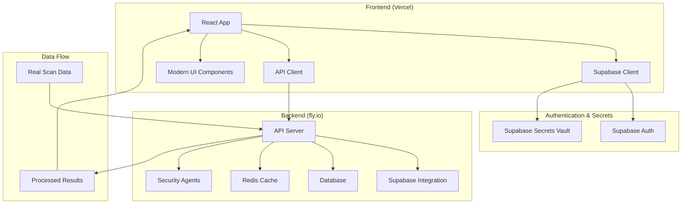

# Design Document

## Overview

This design document outlines the comprehensive solution to fix the AgentScan Security Scanner production deployment issues. The solution involves migrating from simple JWT authentication to Supabase, implementing proper secrets management, fixing API connectivity issues, replacing dummy data with real data integration, and completely overhauling the UI/UX for a modern, professional experience.

## Architecture

### Current Architecture Issues
- Frontend deployed on Vercel with incorrect API endpoint configuration
- Backend deployed on fly.io with hardcoded secrets in environment variables
- Simple JWT authentication without proper user management
- Mock data throughout the frontend with no real API integration
- Poor UI/UX with basic styling and limited functionality

### Target Architecture


## Components and Interfaces

### 1. Supabase Authentication Integration

#### Frontend Authentication Service
```typescript
interface SupabaseAuthService {
  signIn(email: string, password: string): Promise<AuthResponse>
  signUp(email: string, password: string, metadata?: UserMetadata): Promise<AuthResponse>
  signOut(): Promise<void>
  resetPassword(email: string): Promise<void>
  getSession(): Promise<Session | null>
  onAuthStateChange(callback: (event: AuthChangeEvent, session: Session | null) => void): void
}

interface AuthResponse {
  user: User | null
  session: Session | null
  error: AuthError | null
}
```

#### Backend Supabase Integration
```go
type SupabaseClient struct {
    URL       string
    AnonKey   string
    ServiceKey string
    client    *supabase.Client
}

type AuthMiddleware struct {
    supabase *SupabaseClient
}

func (m *AuthMiddleware) ValidateToken(token string) (*User, error)
func (m *AuthMiddleware) GetUserFromToken(token string) (*User, error)
```

### 2. Secrets Management System

#### Supabase Secrets Vault Integration
```typescript
interface SecretsManager {
  getSecret(key: string): Promise<string>
  setSecret(key: string, value: string): Promise<void>
  listSecrets(): Promise<string[]>
  deleteSecret(key: string): Promise<void>
}

// Secrets to migrate:
const SECRETS_TO_MIGRATE = [
  'JWT_SECRET',
  'GITHUB_CLIENT_ID',
  'GITHUB_SECRET',
  'GITLAB_CLIENT_ID', 
  'GITLAB_SECRET',
  'DATABASE_PASSWORD',
  'REDIS_PASSWORD'
]
```

### 3. API Connectivity Fixes

#### Environment Configuration
```typescript
// Frontend environment configuration
interface EnvironmentConfig {
  VITE_API_BASE_URL: string // https://agentscan-security-scanner.fly.dev/api/v1
  VITE_SUPABASE_URL: string
  VITE_SUPABASE_ANON_KEY: string
  VITE_WS_BASE_URL: string // wss://agentscan-security-scanner.fly.dev/ws
}

// Backend CORS configuration
interface CORSConfig {
  allowedOrigins: string[] // Include Vercel domain
  allowedMethods: string[]
  allowedHeaders: string[]
  credentials: boolean
}
```

### 4. Real Data Integration

#### API Response Standardization
```go
type APIResponse struct {
    Success bool        `json:"success"`
    Data    interface{} `json:"data,omitempty"`
    Error   *APIError   `json:"error,omitempty"`
    Meta    *Meta       `json:"meta,omitempty"`
}

type APIError struct {
    Code    string `json:"code"`
    Message string `json:"message"`
    Details map[string]interface{} `json:"details,omitempty"`
}

type Meta struct {
    Pagination *Pagination `json:"pagination,omitempty"`
    Timestamp  time.Time   `json:"timestamp"`
}
```

#### Database Schema Updates
```sql
-- Users table for Supabase integration
CREATE TABLE users (
    id UUID PRIMARY KEY DEFAULT gen_random_uuid(),
    supabase_id UUID UNIQUE NOT NULL,
    email VARCHAR(255) UNIQUE NOT NULL,
    name VARCHAR(255),
    avatar_url TEXT,
    created_at TIMESTAMP DEFAULT NOW(),
    updated_at TIMESTAMP DEFAULT NOW()
);

-- Repositories table
CREATE TABLE repositories (
    id UUID PRIMARY KEY DEFAULT gen_random_uuid(),
    user_id UUID REFERENCES users(id),
    name VARCHAR(255) NOT NULL,
    url TEXT NOT NULL,
    language VARCHAR(100),
    branch VARCHAR(255) DEFAULT 'main',
    created_at TIMESTAMP DEFAULT NOW(),
    last_scan_at TIMESTAMP
);

-- Scans table
CREATE TABLE scans (
    id UUID PRIMARY KEY DEFAULT gen_random_uuid(),
    repository_id UUID REFERENCES repositories(id),
    user_id UUID REFERENCES users(id),
    status VARCHAR(50) NOT NULL,
    progress INTEGER DEFAULT 0,
    findings_count INTEGER DEFAULT 0,
    started_at TIMESTAMP DEFAULT NOW(),
    completed_at TIMESTAMP,
    branch VARCHAR(255),
    commit_hash VARCHAR(255),
    scan_type VARCHAR(50) DEFAULT 'full'
);
```

### 5. Modern UI Component System

#### Design System
```typescript
// Color palette
const colors = {
  primary: {
    50: '#eff6ff',
    500: '#3b82f6',
    600: '#2563eb',
    900: '#1e3a8a'
  },
  success: {
    50: '#f0fdf4',
    500: '#22c55e',
    600: '#16a34a'
  },
  warning: {
    50: '#fffbeb',
    500: '#f59e0b',
    600: '#d97706'
  },
  error: {
    50: '#fef2f2',
    500: '#ef4444',
    600: '#dc2626'
  }
}

// Typography scale
const typography = {
  h1: { fontSize: '2.25rem', fontWeight: '700', lineHeight: '2.5rem' },
  h2: { fontSize: '1.875rem', fontWeight: '600', lineHeight: '2.25rem' },
  body: { fontSize: '1rem', fontWeight: '400', lineHeight: '1.5rem' },
  caption: { fontSize: '0.875rem', fontWeight: '400', lineHeight: '1.25rem' }
}
```

#### Component Architecture
```typescript
// Base component interfaces
interface BaseComponentProps {
  className?: string
  children?: React.ReactNode
  testId?: string
}

interface ButtonProps extends BaseComponentProps {
  variant: 'primary' | 'secondary' | 'ghost' | 'danger'
  size: 'sm' | 'md' | 'lg'
  loading?: boolean
  disabled?: boolean
  icon?: React.ReactNode
  onClick?: () => void
}

interface CardProps extends BaseComponentProps {
  padding?: 'sm' | 'md' | 'lg'
  shadow?: 'sm' | 'md' | 'lg'
  border?: boolean
}
```

### 6. Scan Management System

#### Scan Creation Flow
```typescript
interface ScanCreationFlow {
  // Step 1: Repository Selection
  selectRepository(repositoryId: string): void
  
  // Step 2: Scan Configuration
  configureScan(config: ScanConfig): void
  
  // Step 3: Agent Selection
  selectAgents(agents: string[]): void
  
  // Step 4: Submit and Monitor
  submitScan(): Promise<ScanResponse>
  monitorProgress(scanId: string): Observable<ScanProgress>
}

interface ScanConfig {
  scanType: 'full' | 'incremental'
  branch?: string
  commit?: string
  agents: string[]
  priority: 'low' | 'normal' | 'high'
}
```

## Data Models

### User Management
```typescript
interface User {
  id: string
  supabaseId: string
  email: string
  name: string
  avatarUrl?: string
  createdAt: string
  updatedAt: string
  subscription?: {
    plan: 'free' | 'pro' | 'team' | 'enterprise'
    status: 'active' | 'cancelled' | 'past_due'
  }
}
```

### Repository Management
```typescript
interface Repository {
  id: string
  userId: string
  name: string
  url: string
  language: string
  branch: string
  createdAt: string
  lastScanAt?: string
  scanCount: number
  status: 'active' | 'archived'
}
```

### Scan Management
```typescript
interface Scan {
  id: string
  repositoryId: string
  userId: string
  status: 'queued' | 'running' | 'completed' | 'failed' | 'cancelled'
  progress: number
  findingsCount: number
  startedAt: string
  completedAt?: string
  duration?: string
  branch: string
  commitHash: string
  scanType: 'full' | 'incremental'
  agents: string[]
  findings?: Finding[]
}

interface Finding {
  id: string
  scanId: string
  ruleId: string
  title: string
  description: string
  severity: 'critical' | 'high' | 'medium' | 'low' | 'info'
  filePath: string
  lineNumber: number
  tool: string
  confidence: number
  status: 'open' | 'ignored' | 'fixed' | 'false_positive'
  codeSnippet?: string
  fixSuggestion?: string
}
```

## Error Handling

### Frontend Error Boundaries
```typescript
interface ErrorBoundaryState {
  hasError: boolean
  error?: Error
  errorInfo?: ErrorInfo
}

class GlobalErrorBoundary extends Component<Props, ErrorBoundaryState> {
  // Handle React errors
  static getDerivedStateFromError(error: Error): ErrorBoundaryState
  componentDidCatch(error: Error, errorInfo: ErrorInfo): void
  
  // Handle API errors
  handleApiError(error: ApiError): void
  
  // Handle network errors
  handleNetworkError(error: NetworkError): void
}
```

### Backend Error Handling
```go
type ErrorHandler struct {
    logger *slog.Logger
    sentry *sentry.Client
}

func (h *ErrorHandler) HandleError(c *gin.Context, err error) {
    // Log error
    h.logger.Error("API Error", "error", err, "path", c.Request.URL.Path)
    
    // Send to monitoring
    h.sentry.CaptureException(err)
    
    // Return appropriate response
    switch e := err.(type) {
    case *ValidationError:
        c.JSON(400, APIResponse{Error: &APIError{Code: "VALIDATION_ERROR", Message: e.Message}})
    case *AuthError:
        c.JSON(401, APIResponse{Error: &APIError{Code: "AUTH_ERROR", Message: e.Message}})
    case *NotFoundError:
        c.JSON(404, APIResponse{Error: &APIError{Code: "NOT_FOUND", Message: e.Message}})
    default:
        c.JSON(500, APIResponse{Error: &APIError{Code: "INTERNAL_ERROR", Message: "Internal server error"}})
    }
}
```

## Testing Strategy

### Frontend Testing
```typescript
// Component testing with React Testing Library
describe('LoginForm', () => {
  it('should authenticate with Supabase', async () => {
    render(<LoginForm />)
    
    fireEvent.change(screen.getByLabelText('Email'), { target: { value: 'test@example.com' } })
    fireEvent.change(screen.getByLabelText('Password'), { target: { value: 'password123' } })
    fireEvent.click(screen.getByRole('button', { name: 'Sign In' }))
    
    await waitFor(() => {
      expect(mockSupabaseAuth.signIn).toHaveBeenCalledWith('test@example.com', 'password123')
    })
  })
})

// API integration testing
describe('API Client', () => {
  it('should handle authentication errors', async () => {
    mockSupabaseAuth.getSession.mockResolvedValue(null)
    
    const response = await apiClient.getDashboardStats()
    
    expect(response.error).toEqual({
      code: 'AUTH_ERROR',
      message: 'Authentication required'
    })
  })
})
```

### Backend Testing
```go
func TestSupabaseAuth(t *testing.T) {
    // Test Supabase token validation
    middleware := NewAuthMiddleware(supabaseClient)
    
    // Valid token test
    user, err := middleware.ValidateToken(validToken)
    assert.NoError(t, err)
    assert.NotNil(t, user)
    
    // Invalid token test
    user, err = middleware.ValidateToken(invalidToken)
    assert.Error(t, err)
    assert.Nil(t, user)
}

func TestSecretsManager(t *testing.T) {
    secretsManager := NewSecretsManager(supabaseClient)
    
    // Test secret retrieval
    secret, err := secretsManager.GetSecret("JWT_SECRET")
    assert.NoError(t, err)
    assert.NotEmpty(t, secret)
}
```

### End-to-End Testing
```typescript
// Playwright E2E tests
test('complete scan workflow', async ({ page }) => {
  // Login
  await page.goto('/login')
  await page.fill('[data-testid="email-input"]', 'test@example.com')
  await page.fill('[data-testid="password-input"]', 'password123')
  await page.click('[data-testid="login-button"]')
  
  // Navigate to scans
  await page.click('[data-testid="scans-nav"]')
  
  // Create new scan
  await page.click('[data-testid="new-scan-button"]')
  await page.selectOption('[data-testid="repository-select"]', 'repo-1')
  await page.click('[data-testid="submit-scan-button"]')
  
  // Verify scan creation
  await expect(page.locator('[data-testid="scan-status"]')).toContainText('queued')
})
```

## Security Considerations

### Authentication Security
- Use Supabase Row Level Security (RLS) for data access control
- Implement proper session management with automatic token refresh
- Use secure HTTP-only cookies for session storage where possible
- Implement rate limiting on authentication endpoints

### API Security
- Validate all Supabase tokens on backend requests
- Implement proper CORS configuration for production domains
- Use HTTPS everywhere with proper certificate management
- Implement request signing for sensitive operations

### Secrets Management
- Migrate all secrets from environment variables to Supabase Vault
- Implement secret rotation policies
- Use least-privilege access for secret retrieval
- Audit all secret access and modifications

### Data Protection
- Encrypt sensitive data at rest using Supabase encryption
- Implement proper data retention policies
- Use parameterized queries to prevent SQL injection
- Sanitize all user inputs and outputs

## Performance Optimizations

### Frontend Performance
- Implement code splitting for route-based chunks
- Use React.memo and useMemo for expensive computations
- Implement virtual scrolling for large data sets
- Optimize bundle size with tree shaking and compression

### Backend Performance
- Implement Redis caching for frequently accessed data
- Use database connection pooling
- Implement proper indexing for database queries
- Use background jobs for long-running scan operations

### Network Performance
- Implement proper HTTP caching headers
- Use compression for API responses
- Implement request deduplication
- Use WebSocket connections for real-time updates

## Monitoring and Observability

### Observe MCP Integration for Debugging
```typescript
// MCP Observe integration for real-time debugging
interface ObserveMCPConfig {
  endpoint: string
  apiKey: string
  projectId: string
  environment: 'development' | 'staging' | 'production'
}

interface ObserveLogger {
  logApiCall(request: ApiRequest, response: ApiResponse, duration: number): void
  logError(error: Error, context: Record<string, any>): void
  logUserAction(action: string, userId: string, metadata: Record<string, any>): void
  logScanProgress(scanId: string, progress: number, stage: string): void
  createTrace(operationName: string): ObserveTrace
}

// Backend Observe integration
type ObserveMiddleware struct {
    client *observe.Client
    config *ObserveMCPConfig
}

func (m *ObserveMiddleware) LogRequest(c *gin.Context) {
    // Log all API requests with timing and response codes
    start := time.Now()
    c.Next()
    duration := time.Since(start)
    
    m.client.LogEvent("api_request", map[string]interface{}{
        "method": c.Request.Method,
        "path": c.Request.URL.Path,
        "status": c.Writer.Status(),
        "duration_ms": duration.Milliseconds(),
        "user_id": getUserID(c),
    })
}
```

### Application Monitoring
- Implement Observe MCP for comprehensive request/response logging
- Use Observe MCP for real-time error tracking and debugging
- Implement Supabase Analytics for user behavior tracking
- Use Sentry as backup for critical error tracking
- Implement custom metrics for scan success rates through Observe MCP
- Set up alerts for critical system failures via Observe MCP webhooks

### Infrastructure Monitoring
- Monitor fly.io application health and performance via Observe MCP
- Track Vercel deployment success and performance
- Monitor Supabase database performance and usage
- Implement uptime monitoring for all services
- Use Observe MCP dashboards for real-time system health visualization

### Debug Workflow Integration
- Integrate Observe MCP traces with development workflow
- Implement debug mode that sends detailed logs to Observe MCP
- Create custom dashboards for scan pipeline debugging
- Set up automated alerts for performance degradation
- Implement distributed tracing across frontend and backend

This design provides a comprehensive solution to transform the AgentScan application from its current broken state into a production-ready, secure, and user-friendly security scanning platform.